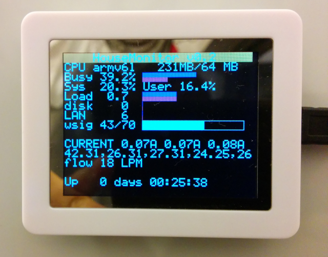
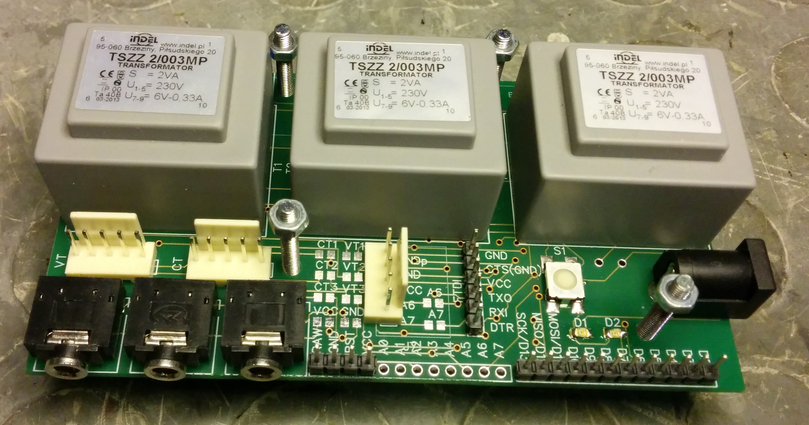
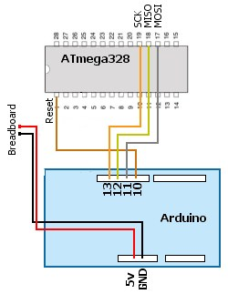

HouseMonitor
============

Tested on RasperryPi type A running Raspbian.

Manual configuration is required, please look at config.js for more information.

Should be started as sudo eg.

    sudo /opt/node/bin/node main.js

And to make it autostart on bootup you can put this in your /etc/rc.local file (before the exit 0 line):

    screen -dmS housemonitor bash
    screen -S housemonitor -X stuff "cd /home/pi/HouseMonitor; /opt/node/bin/node /home/pi/HouseMonitor/main.js\n"
    
Then you can attach to the screen session with

    sudo screen -r housemonitor
    
and detach with 

    CTRL+A+D

Also due to some memory leak in node.js it is recommended to restart HouseMonitor weekly. For example a root cron job  (sudo crontab -e) like this would work:
    
    0 0 * * 2,5 screen -S housemonitor -X stuff $'\003'; screen -S housemonitor -X stuff "cd /home/pi/HouseMonitor; /opt/node/bin/node /home/pi/HouseMonitor/main.js\n"
This will restart housemonitor every Tuesday and Friday.


When socket.io is installed, copy  ~/HouseMonitor/node_modules/socket.io/node_modules/socket.io-client/socket.io.js to dashboard/public/socket.io.js (FIXME)

Due to raspberry corrupting file on power loss (even on usb flash storage) I strongly advise setting up an automated log backup process to a remote storage. For example a cron job that commits logs to github.

###Power Monitor    
describe serial data format and link to arduino .c files

    var powerEmitter = require('./libs/powerMonitor.js').powerEmitter;
    powerEmitter.on('power', function(mainsData) {
    //console.log(mainsData);
    });
Example output:

    TODO...
    


###Temperature monitor   
relies on digitemp which should be installed on your system, more info in config.js


    var tempMonitor = require('./libs/tempMonitor.js');
    var tempEmitter = tempMonitor.tempEmitter;
    tempEmitter.on('temp', function(temps) {
        console.log(temps);
    });
    
Example output:

    [ { addr: '289547CE0400004E', temp: '41.25' },
        { addr: '28B517CE0400006D', temp: '36.62' },
        { addr: '289F50CE040000AC', temp: '39.12' } ]


###Live Data To File Exporter 
 **If this module is used, make sure it is writing to a folder in RAM disk due to relatively high number of writes!**

Outputs last acquired data to certain files in order so that other programs can use it. For example this can be used to display acquired data on a display through lcd4linux.

 

1. To enable it, prepare a folder that is mounted to ram. For example create /var/hm and add this line to /etc/fstab : 

        tmpfs           /var/hm         tmpfs   defaults,noatime,mode=1777,size=1M      0    0

2. Configure the LiveDataToFileExporter section in config.js

        config.liveDataToFileExporter.logsFolder = "/var/hm";
        config.liveDataToFileExporter.temperatureFile = "temps.txt"; 
        config.liveDataToFileExporter.powerFile = "power.txt";
        config.liveDataToFileExporter.flowDataFile = "temps.txt";
    
3. add the following line to main.js

        require('./loggers/liveDataToFileExporter.js');


###Log downsampler   
this should be a deamon that runs periodically and downsamples temperature and power data so that they can be used in
charts

###Dashboard    
The actual web page with charts and other controls


###Circuit board v0.2
 


####Preogramming the arduino bootloader on the onboard atmega328p (tested with an Arduino UNO):

1. Open "PCB/optiLoader/optiLoader.pde" in Arduino IDE (or get latest from https://github.com/WestfW/OptiLoader) and upload it to the arduino.

2. Disconnect Arduino from USB. Wire it up with atmega328p on board:

  
3. Once everything is connected up, re-insert the USB cable. This will reset the Arduino and the burning process will probably begin automatically. Wait until the Tx/Rx LEDs on the Arduino stop flashing before going any further.
4.To get confirmation that all is well open the Arduino IDE Serial Monitor (at 19,200 Baud). This will auto-reset the Arduino and burn the ATmega328 again. Check logs for details.
5. Test the AtMega328p by connecting it to a FTDI/cp2102/pl2303 adapter (VCC,GND,TX,RX,DTR). Inside the IDE, choose the correct COM port, board should be set to "Arduino Mini w/ AtMega328" and upload the blink sketch. Green leed should start blinking.

####Voltage sensing calibration

http://openenergymonitor.org/emon/buildingblocks/ct-and-ac-power-adaptor-installation-and-calibration-theory

    emon1.voltage(3, 92.15, 1.7);  // Voltage: input pin, calibration, phase_shift

    voltage constant = alternating mains voltage ÷ alternating voltage at ADC input pin

In practice, just measure mains voltage with a voltmeter and keep adjusting the voltage constant until the calculated output matches the voltmeter.

####Current sensing calibration

###Static usb device names with udev
Sometimes udev appears to assign names to usb device in an apparently undeterministic way. For example if there are two pl2303 ttl to usb adapters plugged in via a hub, sometimes the first will be named /dev/ttyUSB0 and the second /dev/ttyUSB1 but sometimes it will be the other way around. To avoid such problems, we can assign static names depending on device VID,PID,port on hub etc.

To query for usb information about a device (eg. /dev/ttyUSB0), use:

    udevadm info -a -p $(udevadm info -q path -n /dev/ttyUSB0)
    
To create udev rules create /etc/udev/rules.d/55-pl2303.rules
with the following content:

    ATTRS{idVendor}=="067b", ATTRS{idProduct}=="2303", KERNELS=="1-1.3", SYMLINK+="pl2303_0", MODE="0666"
    ATTRS{idVendor}=="067b", ATTRS{idProduct}=="2303", KERNELS=="1-1.4", SYMLINK+="pl2303_1", MODE="0666"

In this example we set usb devices with VID=0x067b and PID=0x2303 on hub ports 3 and 4 to /dev/pl2303_0 and /pl2303_1

Also /etc/udev/rules.d/56-cp2102.rules

    ATTRS{idVendor}=="10c4", ATTRS{idProduct}=="ea60", KERNELS=="1-1.5", SYMLINK+="cp2102_0", MODE="0666"
    
####PCB v0.3 potential improvements
* Solder bridges for common neutral line on transformers.

##TODO
* update readme
* provide screenshots
* add tests
* add the webpage part
* move libs/* to node_modules/
* in tempLogger.js use MEDIAN instead of AVG to mitigate erroneous outliers
* Add in config filtering thresholds for power and temperatures to use to filter out bad data

##Investigate crash
```
child_process.js:935
    throw errnoException(process._errno, 'spawn');
          ^
Error: spawn ENOMEM
    at errnoException (child_process.js:988:11)
    at ChildProcess.spawn (child_process.js:935:11)
    at exports.spawn (child_process.js:723:9)
    at Object.exports.execFile (child_process.js:607:15)
    at exports.exec (child_process.js:578:18)
    at queryTemp (/home/pi/HouseMonitor/libs/tempMonitor.js:46:5)
    at doQueryTemp (/home/pi/HouseMonitor/libs/tempMonitor.js:35:5)
    at null.<anonymous> (/home/pi/HouseMonitor/libs/tempMonitor.js:93:17)
    at wrapper [as _onTimeout] (timers.js:252:14)
    at Timer.listOnTimeout [as ontimeout] (timers.js:110:15)

```
Could be a memory leak and r.pi running out of memory?